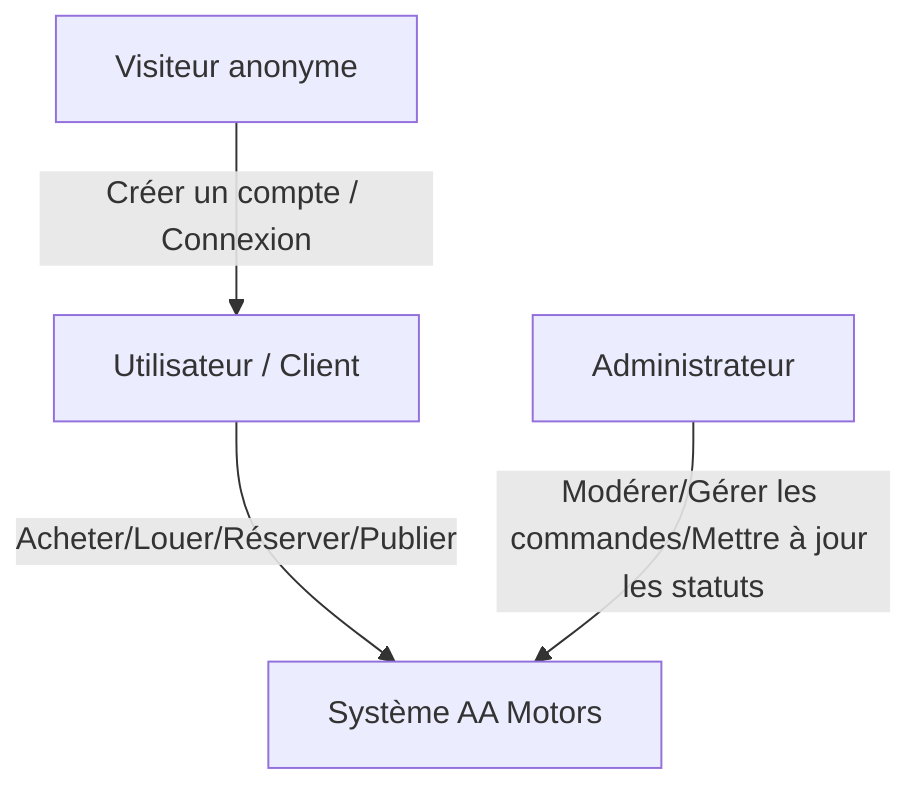
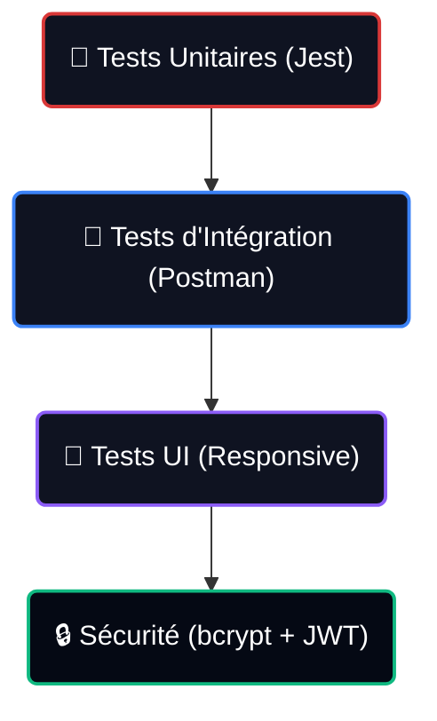

# RAPPORT DE PROJET DE FIN D'ANNÉE
## CONCEPTION ET RÉALISATION D'UNE PLATFORME WEB MULTI-SERVICES POUR CONCESSIONNAIRE MOTO ET DE LOCATION : AA MOTORS

---

### Résumé
Ce rapport présente la conception et le développement de la plateforme web **AA Motors**, un système unifié de gestion de services pour les passionnés de deux-roues. Développée sur la pile technologique **MERN** (MongoDB, Express.js, React, Node.js), cette plateforme répond aux besoins complexes de vente de véhicules, de location de courte et longue durée, d'organisation de road-trips personnalisés avec guides détaillés, ainsi que d'une marketplace Peer-to-Peer d'occasion modérée par un administrateur. Le design a été conçu selon des principes esthétiques haut de gamme et immersifs (thème sombre, néons rouges, glassmorphism) afin d'offrir une expérience utilisateur exceptionnelle.

---

## SOMMAIRE DÉTAILLÉ

### CHAPITRE 1 : INTRODUCTION GÉNÉRALE ET CONTEXTE DU PROJET
1.1. Introduction  
1.2. Contexte du projet et organisme d'accueil  
1.3. Analyse critique de l'existant  
1.4. Solution proposée  
1.5. Méthodologie de gestion de projet  

### CHAPITRE 2 : ANALYSE DES BESOINS ET SPÉCIFICATIONS
2.1. Identification des acteurs  
2.2. Spécification des besoins fonctionnels  
2.3. Spécification des besoins non-fonctionnels  
2.4. Diagrammes des cas d'utilisation (Use Cases)  
2.5. Scénarios détaillés des fonctionnalités clés  

### CHAPITRE 3 : CONCEPTION ET ARCHITECTURE TECHNIQUE
3.1. Choix d'architecture logicielle  
3.2. Architecture physique et logique de l'application MERN  
3.3. Modélisation de la base de données (Schémas NoSQL)  
3.4. Dictionnaire des données  
3.5. Diagrammes de séquence et flux d'information  

### CHAPITRE 4 : RÉALISATION ET IMPLÉMENTATION TECHNIQUE
4.1. Environnement de développement et outils  
4.2. Arborescence détaillée du projet  
4.3. Développement du Backend (API REST, sécurité et routes)  
4.4. Développement du Frontend (Composants React, state management et style)  
4.5. Focus sur les fonctionnalités innovantes (Génération de programme, recalcul dynamique)  

### CHAPITRE 5 : INSTRUCTIONS DE TESTS, DÉPLOIEMENT ET SÉCURITÉ
5.1. Stratégie de tests et validation  
5.2. Mesures de sécurité implémentées  
5.3. Déploiement et intégration continue  
5.4. Conclusion générale et perspectives d'avenir  

---

## CHAPITRE 1 : INTRODUCTION GÉNÉRALE ET CONTEXTE DU PROJET

### 1.1. Introduction
La transformation digitale des entreprises a redéfini les attentes des consommateurs. Aujourd'hui, les clients recherchent l'immédiateté, la centralisation des services et des expériences de marque mémorables. Dans le secteur automobile et moto, la fragmentation des services en ligne constitue un frein majeur à la fidélisation des utilisateurs. Le présent projet de fin d'année consiste à concevoir et réaliser une solution globale pour un concessionnaire moderne combinant vente directe, location, revente entre particuliers et expériences de road-trips.

### 1.2. Contexte du projet et organisme d'accueil
Le projet **AA Motors** a été pensé pour répondre à une double problématique : d'une part, numériser les activités classiques de vente et de location de motos, et d'autre part, fédérer une communauté de motards autour de road-trips organisés et d'une marketplace collaborative. L'objectif est de créer un écosystème web où un utilisateur peut acheter sa moto neuve, la revendre sur la marketplace d'occasion, réserver une moto pour ses vacances, ou s'inscrire à une aventure tout-terrain organisée.

### 1.3. Analyse critique de l'existant
En étudiant le marché des plateformes de motos actuelles, plusieurs points faibles majeurs ont été identifiés :
1. **Dispersion des services** : Les sites web de location de motos n'intègrent presque jamais d'espace d'achat ou de vente d'occasion. Les sites d'itinéraires et de road-trips n'offrent pas d'options directes de location de véhicules adaptés aux circuits proposés.
2. **Interfaces utilisateur obsolètes** : La plupart des plateformes locales utilisent des interfaces génériques, lentes et peu esthétiques, qui ne parviennent pas à susciter l'enthousiasme chez une cible d'utilisateurs passionnés de design et de mécanique.
3. **Absence de transparence sur les réservations** : Les processus de réservation de véhicules ou d'inscription à des voyages se résument souvent à de simples formulaires de contact par e-mail sans confirmation en temps réel ni visibilité sur les statuts des dossiers.

### 1.4. Solution proposée
Pour pallier ces manquements, la plateforme **AA Motors** propose :
- Une **boutique en ligne** dotée d'un panier dynamique et de commandes enregistrées en base de données.
- Un **système de location complet** avec gestion dynamique des tarifs selon le nombre de jours choisis.
- Une **section Road-Trips haut de gamme** affichant des cartes interactives Google Maps, des statistiques de conduite détaillées (km, heures, pauses) et une frise chronologique du programme jour par jour. Le client peut télécharger son itinéraire au format texte/pdf et configurer son voyage (avec ou sans location de moto recommandée incluse).
- Une **Marketplace collaborative** où chaque motard peut soumettre son véhicule à la vente, gérée par un système de validation en arrière-plan.
- Un **panneau d'administration unifié** divisé en quatre modules distincts pour gérer le marketplace, valider les commandes d'achat, suivre les contrats de location classiques et administrer les demandes d'aventures sur mesure.

### 1.5. Méthodologie de gestion de projet
Le projet a été mené selon la méthodologie agile **Scrum**, découpée en cycles de développement (Sprints) d'une à deux semaines :
- **Sprint 1** : Conception, modélisation de la base de données et initialisation du backend et du frontend.
- **Sprint 2** : Développement de l'authentification et du catalogue e-commerce.
- **Sprint 3** : Implémentation du moteur de location et de la marketplace avec formulaires.
- **Sprint 4** : Développement du module Road-Trips (Timeline interactive, téléchargement et configuration).
- **Sprint 5** : Création du panneau d'administration (refactorisation en 4 onglets séparés) et phase de tests/déploiement.

---

## CHAPITRE 2 : ANALYSE DES BESOINS ET SPÉCIFICATIONS

### 2.1. Identification des acteurs
Trois types d'utilisateurs interagissent avec la plateforme :
1. **Le Client / Visiteur** : Navigue sur le site, consulte le catalogue, achète des véhicules ou accessoires, demande des locations ou des inscriptions à des trips, et soumet des motos d'occasion sur la marketplace.
2. **Le Vendeur Marketplace (Particulier)** : Un client connecté qui propose un véhicule personnel à la vente. L'annonce reste "en attente" jusqu'à modération.
3. **L'Administrateur** : Superviseur du système. Il a accès à un tableau de bord privé lui permettant d'approuver ou refuser les annonces, de modifier les statuts des commandes, des locations et des road-trips.



### 2.2. Spécification des besoins fonctionnels
Les besoins fonctionnels décrivent les actions que les utilisateurs et le système doivent pouvoir effectuer :

| ID | Acteur | Description du besoin fonctionnel | Priorité |
|----|--------|------------------------------------|----------|
| BF-01 | Client | S'enregistrer et s'authentifier de manière sécurisée | Haute |
| BF-02 | Client | Consulter les détails techniques des modèles de motos avec galerie d'images | Haute |
| BF-03 | Client | Ajouter des motos/accessoires au panier d'achat et passer commande | Haute |
| BF-04 | Client | Réserver une moto en location en saisissant les dates de début et fin | Haute |
| BF-05 | Client | Consulter les road-trips disponibles avec cartes, km, et programme jour par jour | Haute |
| BF-06 | Client | Configurer son road-trip (choisir d'inclure ou non une moto de location préconisée) | Moyenne |
| BF-07 | Client | Télécharger le programme complet d'un circuit sous forme de document texte/PDF | Moyenne |
| BF-08 | Client | Soumettre une annonce de vente d'occasion sur la marketplace P2P | Moyenne |
| BF-09 | Admin  | Se connecter à l'espace d'administration sécurisé | Haute |
| BF-10 | Admin  | Valider, rejeter ou supprimer les annonces en attente du Marketplace | Haute |
| BF-11 | Admin  | Suivre et changer le statut des commandes d'achat (*En attente, Confirmé, Livré, Annulé*) | Haute |
| BF-12 | Admin  | Gérer les contrats de location (*Réservé, En cours, Terminé, Annulé*) | Haute |
| BF-13 | Admin  | Administrer les réservations de road-trips et adapter les tarifs négociés | Moyenne |

### 2.3. Spécification des besoins non-fonctionnels
Les exigences non-fonctionnelles décrivent les contraintes techniques, ergonomiques et de performance imposées au système :
- **Performance** : Les pages doivent se charger en moins de 2 secondes. Les requêtes sur les catalogues doivent être optimisées grâce à l'indexation MongoDB.
- **Sécurité** : Les mots de passe des utilisateurs doivent être chiffrés en base de données avec l'algorithme `bcrypt`. Les routes sensibles du serveur doivent nécessiter un Token JWT valide.
- **Ergonomie & Esthétique** : Interface haut de gamme ("look showroom") basée sur un thème sombre avec des détails néon rouges (`var(--yamaha-red)`). Le site doit être entièrement responsive et s'adapter aux smartphones, tablettes et ordinateurs.
- **Disponibilité** : L'application doit afficher un taux de disponibilité supérieur à 99%.

### 2.4. Diagrammes des cas d'utilisation (Use Cases)
Voici la spécification textuelle des principaux cas d'utilisation :

#### Cas d'utilisation UC-01 : Effectuer une réservation de Road-Trip
- **Acteur principal** : Client connecté.
- **Préconditions** : L'utilisateur doit être connecté à son compte.
- **Scénario nominal** :
  1. L'utilisateur accède à la page "Location & Trips".
  2. Il clique sur un circuit spécifique (ex: *Route de l'Atlas*).
  3. Le système affiche la page de détails comprenant les images, la carte, les kilomètres, la durée et la timeline.
  4. L'utilisateur choisit l'option "Je veux louer une moto de chez vous".
  5. Il sélectionne un modèle suggéré dans la grille.
  6. Le système calcule dynamiquement le tarif (Prix du trip + Prix journalier de la moto * Nombre de jours).
  7. L'utilisateur remplit le formulaire de coordonnées et valide la réservation.
  8. Le système enregistre la demande (`BookingRequest`) et affiche un message de succès.
- **Postconditions** : La demande apparaît dans le panneau d'administration de l'onglet "Réservations Trips" sous l'état "En attente".

---

## CHAPITRE 3 : CONCEPTION ET ARCHITECTURE TECHNIQUE

### 3.1. Choix d'architecture logicielle
L'application utilise une architecture orientée services (REST API) permettant de dissocier totalement le développement du client (React) et du serveur (Node/Express). Cette approche offre une grande flexibilité en cas de future migration vers une application mobile native (React Native) car l'API reste identique.

### 3.2. Architecture physique et logique de l'application MERN

```
  ┌─────────────────────────────────────────────────────────────┐
  │                   INTERFACE UTILISATEUR (REACT)              │
  └──────────────────────────────┬──────────────────────────────┘
                                 │ Requêtes HTTP (Axios / Fetch)
                                 ▼
  ┌─────────────────────────────────────────────────────────────┐
  │                 SERVEUR NODE / EXPRESS API                  │
  │  ┌───────────────────────┐       ┌───────────────────────┐  │
  │  │      Middlewares      │       │      Contrôleurs      │  │
  │  └───────────────────────┘       └───────────────────────┘  │
  └──────────────────────────────┬──────────────────────────────┘
                                 │ Requêtes de données (Mongoose)
                                 ▼
  ┌─────────────────────────────────────────────────────────────┐
  │                      BASE DE DONNÉES MONGODB                │
  └─────────────────────────────────────────────────────────────┘
```

### 3.3. Modélisation de la base de données (Schémas NoSQL Mongoose)

Pour stocker les données, 5 schémas principaux ont été modélisés via Mongoose :

#### A. Schéma Utilisateur (`User.js`)
```javascript
const userSchema = new mongoose.Schema({
  name: { type: String, required: true },
  email: { type: String, required: true, unique: true },
  password: { type: String, required: true },
  role: { type: String, enum: ['user', 'admin'], default: 'user' },
  createdAt: { type: Date, default: Date.now }
});
```

#### B. Schéma Véhicule (`Vehicle.js`)
```javascript
const vehicleSchema = new mongoose.Schema({
  name: { type: String, required: true },
  category: { type: String, enum: ['Sportive', 'Roadster', 'Adventure', 'Scooter', 'JetSki'], required: true },
  price: { type: Number, required: true },
  image: { type: String, required: true },
  description: { type: String },
  specs: {
    engine: String,
    power: String,
    weight: String
  }
});
```

#### C. Schéma Commande (`Order.js`)
```javascript
const orderSchema = new mongoose.Schema({
  user: { type: mongoose.Schema.Types.ObjectId, ref: 'User', required: true },
  items: [{
    name: String,
    quantity: Number,
    price: Number,
    color: String
  }],
  totalPrice: { type: Number, required: true },
  fullName: { type: String, required: true },
  phone: { type: String, required: true },
  city: { type: String, required: true },
  address: { type: String, required: true },
  status: { type: String, enum: ['en attente', 'confirmé', 'livré', 'annulé'], default: 'en attente' },
  createdAt: { type: Date, default: Date.now }
});
```

#### D. Schéma Location de Moto (`Reservation.js`)
```javascript
const reservationSchema = new mongoose.Schema({
  user: { type: mongoose.Schema.Types.ObjectId, ref: 'User', required: true },
  vehicle: { type: mongoose.Schema.Types.ObjectId, ref: 'Vehicle', required: true },
  startDate: { type: Date, required: true },
  endDate: { type: Date, required: true },
  totalPrice: { type: Number, required: true },
  status: { type: String, enum: ['pending', 'confirmed', 'cancelled'], default: 'pending' },
  createdAt: { type: Date, default: Date.now }
});
```

#### E. Schéma Réservation de Trip Organisé (`BookingRequest.js`)
```javascript
const bookingRequestSchema = new mongoose.Schema({
  nom: { type: String, required: true },
  email: { type: String, required: true },
  telephone: { type: String, required: true },
  destination: { type: String, required: true },
  type: { type: String, enum: ['Organisé', 'Sur Mesure'], required: true },
  motoSelectionnee: { type: String, default: 'Propre Moto' },
  prixTotal: { type: String, default: 'Devis requis' },
  message: { type: String },
  status: { type: String, enum: ['pending', 'confirmé', 'terminé', 'annulé'], default: 'pending' },
  createdAt: { type: Date, default: Date.now }
});
```

### 3.4. Dictionnaire des données
Le dictionnaire suivant définit le format et les règles de validation appliqués aux attributs les plus sensibles du système :

| Table / Collection | Attribut | Type | Contraintes | Rôle / Description |
|--------------------|----------|------|-------------|--------------------|
| Users | `email` | String | Unique, requis | Identifiant de connexion unique |
| Users | `password` | String | Requis, crypté | Mot de passe de l'utilisateur (haché bcrypt) |
| Orders | `totalPrice` | Number | Requis, > 0 | Montant total de la commande d'achat |
| Reservations | `startDate` | Date | Requis | Date de début de la location du véhicule |
| Reservations | `endDate` | Date | Requis, > startDate | Date de fin de la location du véhicule |
| BookingRequests | `prixTotal` | String | Requis | Prix calculé en DH ou chaîne 'Devis requis' |

### 3.5. Diagrammes de séquence et flux d'information
Voici le flux d'échange lors de la création d'une réservation de trip :

```
Client (React)                Serveur (Express API)              Base MongoDB
     │                                 │                              │
     │─── POST /api/bookings ─────────>│                              │
     │    (Coordonnées, Trip, Moto)    │                              │
     │                                 │─── Vérifier & Valider data ──>│
     │                                 │                              │
     │                                 │<─── Schéma OK, insertion ────│
     │                                 │                              │
     │<── Réponse JSON 201 (Succès) ───│                              │
     │                                 │                              │
```

---

## CHAPITRE 4 : RÉALISATION ET IMPLÉMENTATION TECHNIQUE

### 4.1. Environnement de développement et outils
Les technologies et outils utilisés pour le développement du projet sont :
- **IDE** : Visual Studio Code avec extensions (ESLint, Prettier, GitLens).
- **Gestionnaire de Base de Données** : MongoDB Compass pour visualiser et modifier directement les collections stockées localement.
- **Tests API** : Postman pour effectuer les requêtes de tests d'intégration (GET, POST, PUT, DELETE) sur l'ensemble de nos endpoints.
- **Environnement d'exécution** : Node.js (v18.x) pour exécuter l'API et le serveur de développement.

### 4.2. Arborescence détaillée du projet
Voici la structure simplifiée des répertoires du projet montrant la séparation nette entre le backend et le frontend :

```
projet-pfa/
├── backend/
│   ├── controllers/
│   │   ├── bookingController.js      # Contrôle les requêtes de road-trips
│   │   ├── orderController.js        # Gestion des commandes achats
│   │   └── userController.js         # Inscription & authentification
│   ├── models/
│   │   ├── BookingRequest.js         # Modèle NoSQL pour les Road-Trips
│   │   ├── Reservation.js            # Modèle pour les locations de motos
│   │   └── Order.js                  # Modèle pour les achats
│   ├── routes/
│   │   ├── bookingRoutes.js          # Routes HTTP liées aux road-trips
│   │   └── orderRoutes.js            # Routes d'achats
│   ├── server.js                     # Point d'entrée principal de l'API Node
│   └── package.json
└── frontend/
    ├── public/
    └── src/
        ├── assets/                   # Images des véhicules et des trips
        ├── components/
        │   ├── Navbar.js             # Menu de navigation global
        │   └── Footer.js             # Pied de page interactif
        ├── data/
        │   ├── rentalFleet.js        # Liste des motos en location
        │   └── tripData.js           # Catalogue des road-trips
        ├── pages/
        │   ├── AdminDashboard.js     # Panneau de contrôle d'administration
        │   ├── LocationTrips.js      # Liste des locations et trips
        │   ├── TripDetail.js         # Fiche d'aventure détaillée (3 blocs)
        │   └── CSS/
        │       ├── Location.css      # Thème rouge Yamaha global
        │       └── TripDetail.css    # Style premium glassmorphism
        └── App.js                    # Système de routes React
```

### 4.3. Développement du Backend (API REST, sécurité et routes)
Le backend a été conçu de manière modulaire. Le fichier `server.js` importe les différentes routes de l'API. Voici le contrôleur de réservation des trips (`bookingController.js`) qui illustre le stockage des requêtes :

```javascript
const BookingRequest = require('../models/BookingRequest');

// Créer une nouvelle demande de réservation
exports.createBooking = async (req, res) => {
  try {
    const { nom, email, telephone, destination, type, motoSelectionnee, prixTotal, message } = req.body;
    
    const newBooking = new BookingRequest({
      nom,
      email,
      telephone,
      destination,
      type,
      motoSelectionnee,
      prixTotal,
      message
    });

    await newBooking.save();
    res.status(201).json({ message: "Réservation enregistrée avec succès !", booking: newBooking });
  } catch (error) {
    res.status(500).json({ message: "Erreur lors de l'enregistrement", error: error.message });
  }
};
```

Les routes d'administration sont protégées par un middleware d'authentification (`authMiddleware.js`) qui décode le Token JWT envoyé dans les en-têtes et vérifie le rôle d'administrateur de l'utilisateur.

### 4.4. Développement du Frontend (Composants React et style premium)
Le frontend est le point fort visuel du projet. L'interface utilise les principes du **Neumorphism** et du **Glassmorphism**.
Voici un exemple d'implémentation de la timeline jour par jour dans le composant `TripDetail.js` :

```jsx
{trip.itinerary ? (
  <div className="itinerary-timeline">
    {trip.itinerary.map((item, index) => (
      <div key={index} className="timeline-item">
        <div className="timeline-dot"></div>
        <div className="timeline-content">
          <span className="timeline-day">{item.day}</span>
          <h3 className="timeline-title">{item.title}</h3>
          <p className="timeline-details">{item.details}</p>
        </div>
      </div>
    ))}
  </div>
) : (
  <p>Détails du programme à venir.</p>
)}
```

Le CSS associé (`TripDetail.css`) applique l'effet de flou en arrière-plan à l'aide de la propriété `backdrop-filter: blur(24px)` et ajoute des animations fluides d'apparition :

```css
.trip-bloc-4-itinerary {
  margin-top: 50px;
  background: rgba(20, 25, 35, 0.4);
  backdrop-filter: blur(24px);
  -webkit-backdrop-filter: blur(24px);
  border: 1px solid rgba(255, 255, 255, 0.05);
  box-shadow: 0 30px 60px rgba(0, 0, 0, 0.4);
  border-radius: 24px;
  padding: 50px;
  animation: slideUpFade 0.8s ease-out 0.8s forwards;
  opacity: 0;
}
```

### 4.5. Focus sur les fonctionnalités innovantes

#### A. Génération et téléchargement dynamique de documents
Pour permettre aux utilisateurs de conserver le programme d'un circuit de road-trip sur leur appareil, un bouton de téléchargement dynamique a été implémenté en Javascript pur à l'aide d'un objet `Blob`. Ce code permet d'instancier un fichier texte contenant le détail structuré du trip et d'initier un téléchargement immédiat dans le navigateur :

```javascript
const handleDownload = () => {
  const content = `PROGRAMME DU ROAD-TRIP : ${trip.title}\n\n` + 
                  `Kilométrage: ${trip.km}\n` +
                  `Durée du circuit: ${trip.duration}\n` +
                  `Nombre de pauses suggérées: ${trip.pauses}\n\n` +
                  `ITINÉRAIRE JOUR PAR JOUR :\n` +
                  trip.itinerary.map(item => `\n- ${item.day} : ${item.title}\n  ${item.details}`).join("\n");
  
  const blob = new Blob([content], { type: 'text/plain;charset=utf-8' });
  const url = URL.createObjectURL(blob);
  const link = document.createElement('a');
  link.href = url;
  link.download = `Itineraire_AA_Motors_${trip.title.replace(/\s+/g, '_')}.txt`;
  link.click();
  URL.revokeObjectURL(url);
};
```

#### B. Calcul de prix dynamique
Le composant `TripDetail.js` recalcule en temps réel le coût de l'aventure en fonction de l'option choisie par le client (utiliser sa moto personnelle ou en louer une recommandée par la plateforme) :

```javascript
const tripPrice = trip.price;
const rentalPrice = selectedMoto ? selectedMoto.pricePerDay * tripDays : 0;
const totalPrice = hasOwnMoto ? tripPrice : (tripPrice + rentalPrice);
```

---

## CHAPITRE 5 : TESTS, SÉCURITÉ ET DÉPLOIEMENT

### 5.1. Stratégie de tests et validation
Pour certifier le bon fonctionnement de l'application web, plusieurs types de tests ont été menés durant le cycle de développement :
1. **Tests Unitaires** : Validation des fonctions de formatage (ex: formatage des prix en DH, calcul des jours entre deux dates pour la location).
2. **Tests d'Intégration** : Validation des requêtes d'envoi et de récupération de données entre React et l'API Express.
3. **Tests d'Interface Utilisateur (UI)** : Validation de la réactivité visuelle des composants en changeant la taille de l'écran (Responsive testing) et vérification du bon fonctionnement des sliders de photos et des accordions.
4. **Vérification en temps réel** : Test de soumission de formulaires de réservations et vérification instantanée de l'apparition de la nouvelle ligne dans le tableau de bord Admin correspondant.



### 5.2. Mesures de sécurité implémentées
La sécurité a été intégrée dès la phase de conception logicielle :
- **Hachage des données sensibles** : Les mots de passe utilisateurs ne sont jamais stockés en clair. L'algorithme de hachage unidirectionnel `bcrypt` génère une empreinte unique sécurisée contenant un grain de sel (salt).
- **Protection des Routes API** : Les routes de création de commandes et de modification de statuts nécessitent la présence d'un Token Web JSON (JWT) dans les en-têtes HTTP de la requête.
- **Vérification d'accès Admin** : Côté Frontend, l'accès au panneau de bord d'administration est conditionné par la vérification de l'adresse email de l'utilisateur connecté (`isAdmin`), bloquant les tentatives d'accès non autorisées avec affichage d'un écran d'accès refusé sécurisé.
- **Validation des données** : Le framework Express utilise des validateurs en amont de l'accès à la base de données pour rejeter les requêtes malformées ou contenant des injections JavaScript.

### 5.3. Déploiement et intégration continue
Le projet a été configuré pour être facilement déployé :
- La base de données peut être migrée de manière transparente vers **MongoDB Atlas** (cloud).
- Le backend peut être hébergé sur des plateformes de type **Render** ou **Heroku**.
- Le frontend React peut être déployé sur **Vercel** ou **Netlify** avec configuration automatique des variables d'environnement (`REACT_APP_API_URL`) pour pointer vers l'instance backend hébergée.

### 5.4. Conclusion générale et perspectives d'avenir
Le développement de la plateforme **AA Motors** a permis de réaliser un écosystème e-commerce complet et performant, offrant une valeur ajoutée significative pour les professionnels et les adeptes de motocyclisme. L'utilisation combinée de la stack MERN et de techniques modernes de stylisation (Glassmorphism, animations fluides, thématique sombre exclusive) a permis d'aboutir à un produit fini élégant et prêt à l'emploi.

Les perspectives d'évolution pour ce projet incluent :
- **Intégration de paiements réels** : Liaison avec les API de Stripe ou Paypal pour valider directement les commandes d'achats et les acomptes de location.
- **Module communautaire** : Permettre aux motards de poster leurs propres road-trips personnels et de partager des photos de leurs parcours.
- **Suivi des véhicules de location** : Intégration d'un module de géolocalisation en temps réel des motos en location sur une carte interactive disponible pour l'administrateur.

---
### BIBLIOGRAPHIE ET RÉFÉRENCES
1. *Documentation Officielle React.js* - https://react.dev
2. *Mongoose ODM Documentation* - https://mongoosejs.com
3. *Express.js API Reference* - https://expressjs.com
4. *Bcrypt.js Security best practices* - npmjs.com/package/bcrypt
5. *Google Material Design Guidelines (Dark Mode & Spacing)* - material.io
